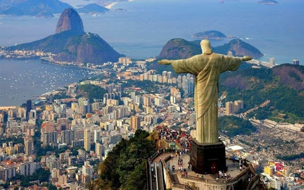

# Argentina

President: Mauricio Macri (2015)

Land area: 1,056,636 sq mi (2,736,690 sq km); total area: 1,068,296 sq mi (2,766,890 sq km)

Population (2014 est.): 43,024,374 (growth rate: .95%); birth rate: 16.88/1000; infant mortality rate: 9.962/1000; life expectancy: 77.51

Capital and largest city (2011 est.): Buenos Aires, 13.528 million

Other large cities: Córdoba, 1.556 million; Rosario 1.283 million; Mendoza 957,000; San Miguel de Tucuman 868,000; La Plata 759,000 (2011)

Monetary unit: Peso

National name: República Argentina

Current government officials

Languages: Spanish (official), English, Italian, German, French

Ethnicity/race: white (mostly Spanish and Italian) 97%, mestizo (mixed white and Amerindian ancestry), Amerindian, or other non-white groups 3%

National Holiday: Revolution Day, May 25

Literacy rate: 97.9% (2011 est.)

Economic summary: GDP/PPP (2013 est.): $771 billion; per capita $18,600. Real growth rate: 3.5%. Inflation: 20.8% official rate; actual rate may be double the official rate. Unemployment: 7.5%. Arable land: 13.68%. Agriculture: sunflower seeds, lemons, soybeans, grapes, corn, tobacco, peanuts, tea, wheat; livestock. Labor force: 173.2 million: note: urban areas only (2011 est.); agriculture: 5%, industry: 23%, services: 72% (2009 est.). Industries: food processing, motor vehicles, consumer durables, textiles, chemicals and petrochemicals, printing, metallurgy, steel. Natural resources: fertile plains of the pampas, lead, zinc, tin, copper, iron ore, manganese, petroleum, uranium. Exports: $85.08 billion (2013 est.): edible oils, fuels and energy, cereals, feed, motor vehicles. Imports: $71.3 billion (2013 est.): machinery and equipment, motor vehicles, chemicals, metal manufactures, plastics. Major trading partners: Brazil, Chile, U.S., China, U.S., Germany (2012).

Communications: Telephones: main lines in use 10 million (2012); mobile cellular: 58.6 million (2012). Broadcast media: government owns a TV station and a radio network; more than 2 dozen TV stations and hundreds of privately owned radio stations; high rate of cable TV subscription usage (2007). Internet hosts: 11.232 million (2012). Internet users: 13.694 million (2009).

Transportation: Railways: total: 36,966 km (2011). Highways: total: 231,374 (2004). Waterways: 11,000 km (2012). Ports and harbors: Bahia Blanca, Buenos Aires, La Plata, Punta Colorada, Ushuaia. Airports: 1,138 (2013).

International disputes: Argentina continues to assert its claims to the UK-administered Falkland Islands (Islas Malvinas), South Georgia, and the South Sandwich Islands in its constitution, forcibly occupying the Falklands in 1982, but in 1995 agreed to no longer seek settlement by force; UK continues to reject Argentine requests for sovereignty talks; territorial claim in Antarctica partially overlaps UK and Chilean claims; uncontested dispute between Brazil and Uruguay over Braziliera/Brasiliera Island in the Quarai/Cuareim River leaves the tripoint with Argentina in question; in 2010, the ICJ ruled in favor of Uruguay's operation of two paper mills on the Uruguay River, which forms the border with Argentina; the two countries formed a joint pollution monitoring regime; the joint boundary commission, established by Chile and Argentina in 2001 has yet to map and demarcate the delimited boundary in the inhospitable Andean Southern Ice Field (Campo de Hielo Sur); contraband smuggling, human trafficking, and illegal narcotic trafficking are problems in the porous areas of the border with Bolivia.

Geography: Second in South America only to Brazil in size and population, Argentina is a plain, rising from the Atlantic to the Chilean border and the towering Andes peaks. Aconcagua (22,834 ft, 6,960 m) is the highest peak in the world outside Asia. Argentina is also bordered by Bolivia and Paraguay on the north, and by Uruguay and Brazil on the east. The northern area is the swampy and partly wooded Gran Chaco, bordering Bolivia and Paraguay. South of that are the rolling, fertile Pampas, which are rich in agriculture and sheep- and cattle-grazing and support most of the population. Further south is Patagonia, a region of cool, arid steppes with some wooded and fertile sections.

Government: Republic.

History: First explored in 1516 by Juan Diaz de Solis, Argentina developed slowly under Spanish colonial rule. Buenos Aires was settled in 1580; the cattle industry was thriving as early as 1600. Invading British forces were expelled in 1806&mdash;1807, and after Napoleon conquered Spain (1808), the Argentinians set up their own government in 1810. On July 9, 1816, independence was formally declared. As it had in World War I, Argentina proclaimed neutrality at the outbreak of World War II, but in the closing phase declared war on the Axis powers on March 27, 1945. Juan D. Peron, an army colonel, emerged as the strongman of the postwar era, winning the presidential elections of 1946 and 1951. Peron's political strength was reinforced by his second wife—Eva Duarte de Peron (Evita)—and her popularity with the working classes. Although she never held a government post, Evita acted as de facto minister of health and labor, establishing a national charitable organization, and awarding generous wage increases to the unions, who responded with political support for Peron. Opposition to Peron's increasing authoritarianism led to a coup by the armed forces, which sent Peron into exile in 1955, three years after Evita's death. Argentina entered a long period of military dictatorships with brief intervals of constitutional government. The former dictator returned to power in 1973 and his third wife, Isabel Martinez de Peron, was elected vice president. After her husband's death in 1974, Peron became the hemisphere's first woman chief of state, assuming control of a nation teetering on economic and political collapse. In 1975, terrorist acts by left- and right-wing groups killed some 700 people. The cost of living rose 355%, and strikes and demonstrations were constant. On March 24, 1976, a military junta led by army commander Lt. Gen. Jorge Rafael Videla seized power and imposed martial law.
